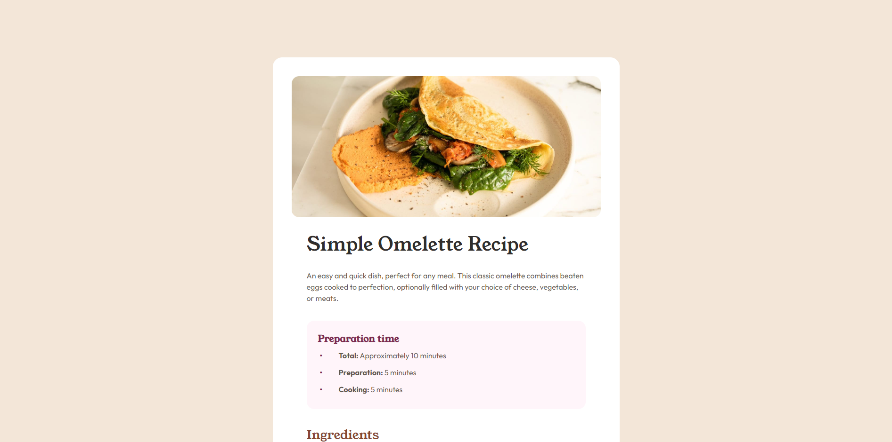
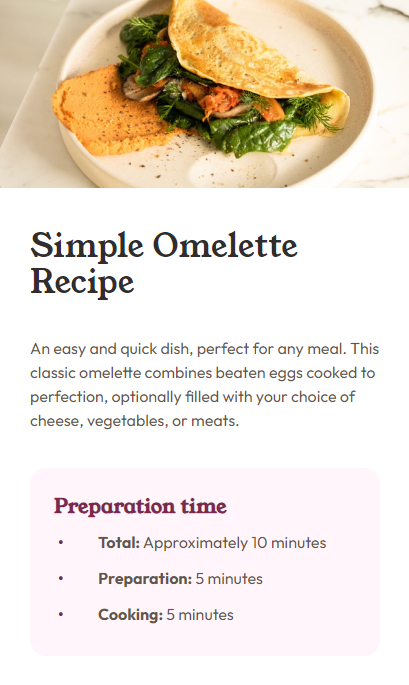

# Frontend Mentor - Recipe page solution

This is a solution to the [Recipe page challenge on Frontend Mentor](https://www.frontendmentor.io/challenges/recipe-page-KiTsR8QQKm). Frontend Mentor challenges help me improve mine coding skills by building realistic projects. 

## Table of contents

- [Overview](#overview)
  - [The challenge](#the-challenge)
  - [Screenshot](#screenshot)
  - [Links](#links)
- [My process](#my-process)
  - [Built with](#built-with)
  - [What I learned](#what-i-learned)
  - [Continued development](#continued-development)
  - [Useful resources](#useful-resources)
- [Author](#author)
- [Acknowledgments](#acknowledgments)


## Overview

### Screenshot

desktop preview



mobile view




### Links

- Solution URL: [solution URL here](https://www.frontendmentor.io/solutions/recipe-page-Qeh2689taZ)
- Live Site URL: [live site URL here](https://DarekRepos.github.io/Recipe-page/)

## My process

### Built with

- Semantic HTML5 markup
- CSS custom properties
- Flexbox
- CSS Grid
- Mobile-first workflow
- vite
- SCSS

### What I learned

This project is a great way to improve attention to design details. There was a lot of small elements that change code that can be display in an exact way. I forced to use some ccs tricks to display elements. 
I have to use a lot of css trick like formatting lines in table and trick with bullet points like below:

```html
<div class="text-bullet-centered bullet-color">&#x2022;</div>
```
```css
.text-bullet-centered {
    position: absolute;
    left: -.5rem;
    top: 50%;
    transform: translate(0%, -50%);
    font-weight: bold;

}

div.bullet-color {
        color: var(--c-primary-dark-raspberry);
}

```

### Continued development

I want to focus more on sematic html and practice more with styles using scss. 

### Useful resources

- MDN Web Docs - this help me mostly with html and javascript part. 

- Sass, Vite Documentation - it help me with issues with deploying

- Lighthouse and Performance Insights Tool in  Chrome - i use this tool to check performance and how my website behave on different screens (mobile, desktop, tablet)

- [CSS-Tricks](https://css-tricks.com/) - this help me a lot with best css practices like box-sizning css resetings etc.. I really liked this patterns and will use it going forward.

- [Figma](https://www.figma.com/) - Paste your design image to check the size of containers, width, etc.

## Author

- Website - [Darek](https://www.darek-duda.pl)
- Frontend Mentor - [@DarekRepos](https://www.frontendmentor.io/profile/DarekRepos)

## Acknowledgments

A big thank you to anyone who provides feedback.